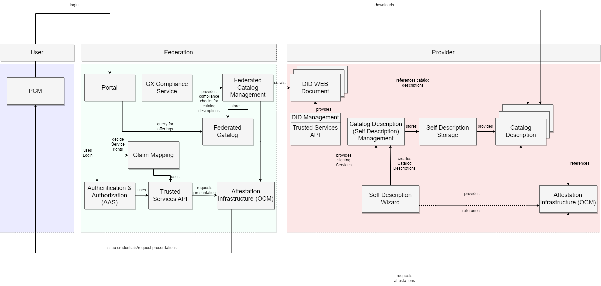
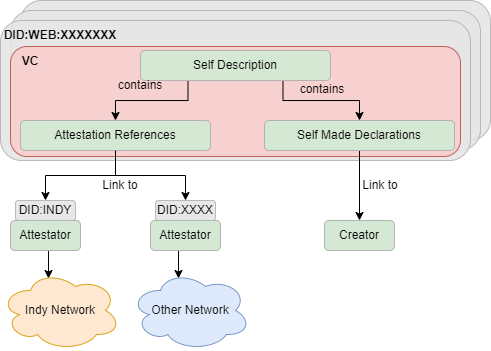
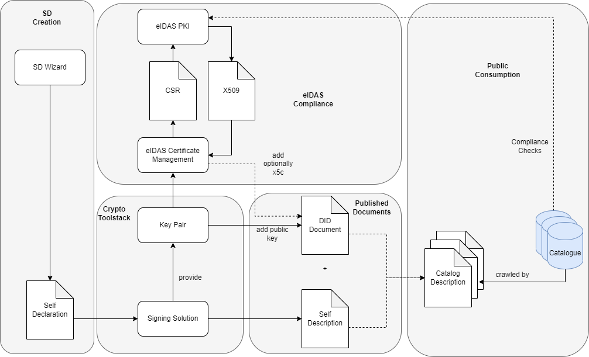

# Integration Guidelines

## Introduction

The integration goal of this project is to provide an up and running cluster of a federation out of the box. This shall be realized by Helm charts and Argo CD projects. Details about the setup can be found [here](SETUP.md).


## Federation Architecture

### Overview 

This picture illustrates the architecture of the federation and the basic components for it. For the moment the setup is dual use for provider and federator, but it can be split by separated Argo CD environments. 

<p align="center">
  
</p>


### Self Description/Metadata Umbrella

The self-description has the purpose to declare metadata about an entity as public resolvable information. This could be a service offering, a resource such as a data center, or something else. When the purpose of the self-description is to a catalog, it is automatically a _catalog description_, because a self-description SHOULD be made especially for one catalog. The declaration can be given in the form of _self-made declarations_ or by replacing them by _attestation references_, which can be secured by any kind of ledger network or other technologies. If an attestation reference is provided, sufficient infrastructure MUST be provided to enable references to be resolved at any time. This means that, if, e.g., an certificate of conformity with an ISO standard is issued, and the attestation is referenced in the description, the holder of the certificate MUST be able to prove it when it is requested by the verifier. All self-descriptions are signed by the declaring party to ensure that the statements are not tampered, and optionally that the declaration is eIDAS compliant during the creation or the time of usage (for this purpose eIDAS signatures have to be used for the catalog description).

<p align="center">
  
</p>


Using the did:web method is mandatory for creating self-descriptions to establish the metadata universe within the data space. For the did:web, the following points MUST be considered: 

- the key pair should be created automatically by any kind of vault
- for signatures of the descriptions, the key pair should be used to request eIDAS compliant certificates (not yet implemented, can be made by creating CSRs automatically)
- the DID should be created automatically and never be reused by any other asset; in the best case, there is one DID per asset a catalog (in this example we just create it manually by using DID Management)


### Provider Requirements
Core Requirement for the Provider is to create the did:web Documents for providing the catalog description references. This means each provider MAY provide per federation a catalog description but MUST provide at least one catalog description for its offering. Important here is, that each and every asset gets a did:web. Therefore, the [DID Management](https://gitlab.com/gaia-x/data-infrastructure-federation-services/por/did-management-service) was created to provide an easy way of creating DIDs over the TSA to provide it to the public. An example can be found [here](https://integration.gxfs.dev/api/dynamic/did/legalInformation). Each DID Document contains key pairs, which are created explicitly for each DID by using HashiCorp Vault in the background. Each created self-description must be linked to the relevant did:web to be signed correctly by TSA. In this example, the did:web were created using the DID Management and linked manually to the self-description (because the SD Creation Wizard does not yet support the required linkage). 

The provider MUST also append all relevant attestation references into the catalog descriptions so far required.


By resolving this DID, the catalog description can be picked up by using the service endpoint in the did document, which references to the [self-description storage](https://integration.gxfs.dev/api/self-descriptions/description?did=did%3Aweb%3Aintegration.gxfs.dev%3Aapi%3Adynamic%3Adid%3AlegalInformation). An example implementation of the storage can be found [here](https://gitlab.com/gaia-x/lab/gaia-x-example-self-description-storage) and [here](https://gitlab.com/gaia-x/data-infrastructure-federation-services/por/self-description-management). The federator is then able to pick up all catalog descriptions during the onboarding without any further action. For the moment, the assumption is that the catalog descriptions and the containing information are downloaded during the onboarding in the federator without the need of additional authentication against the provider (which can be relevant for some kinds of federations). 

### Federator Requirements

The federation MUST provide an onboarding process for a business owner by issuing a credential in the business owner's PCM. If this is done, the business owner is able to onboard a did:web for this service, which is then crawled by the federated catalog management. All downloaded information will be checked for compliance and later added to the catalog for indexing the information for search. This download will be made in regular intervals to guarantee the availability of the data. If someone requests the proof for the contained attestations, the attestation infrastructure can request it on demand or automatically.

## Catalog Description


### Creation

At first, the self-declaration is made by using a tool such as the Self Declaration Wizard. If the declaration was made, a signing tool, e.g., the TSA signing service can be used to use the private key of a key pair to sign the SD by wrapping it into a VC which is published as Self Description on a public endpoint, linked to a DID. The DID needs to be generated beforehand together with the key pair or optionally with a X509 certificate in the JWK of the verification methods. After resolving the DID document and the self-description, the signature can be checked as for compliance and validity. 

<p align="center">
  
</p>


### Attestation References
TBD

### Attestation Infrastructure and Proofs

TBD

### Self Description Linkage Credential

TBD

### Self Description Linkage Presentation

The self-description linkage presentation is a VP container, which is generated by the SD storage to "pack" a set of SD linkage credentials for a compliance approval. The compliance checkup is then able to rely on just one set of data instead of resolving all one by one. This allows a "versioning" of the statements according to compliance version X. The result of this checkup should be a compliance credential issued directly into the wallet of the holder. 

## How to Set up a Self Description and provide it to a Catalog

The self-description MUST be created semantically correct over a tool or manual (e.g., the Self-Description Creation Wizard). In the best case, a self-description contains only attestation references, but depending on the use case, the claims can be self-declared as well. After creating the SD it MUST be ensured that: 

1. the SD is packaged into a VC
2. signed by a unique key pair referring to a DID (in the best case, the key pair is certified by an eIDAS compliant PKI)
3. the signed VC is published over a resolvable URL
4. the URL is referenced in the did:web under `gx-catalog-description`


Example Output:

```
{
  "@context": [
    "https://www.w3.org/2018/credentials/v1",
    "http://schema.org"
  ],
  "credentialSubject": {
    "description": {
      "@context": {
        "schema": "http://schema.org/"
      },
      "@id": "did:web:registry.gaia-x.eu:Provider:MuHsI8a92lQ05y4qeUZlWzDRgaej4Irvd4s2",
      "@type": "trusted-cloud:legalInformation",
      "attestationReference": {
        "name": "Legal Information",
        "presentationDefinition": {
          "input_descriptors": [
            {
              "constraints": {
                "fields": [
                  {
                    "filter": {
                      "const": "AR7nFzwhjpm5AamWKLu4JA:2:gxfs-legal-information-v:1.0.0",
                      "type": "string"
                    },
                    "path": [
                      "$.schemaId"
                    ]
                  },
                  {
                    "path": [
                      "$.did",
                      "$.credentialSubject",
                      "$.legalName",
                      "$.legalForm",
                      "$.registrationNumber",
                      "$.headquarterAdress",
                      "$.vatNumber",
                      "$.registrationDate",
                      "$.SME",
                      "$.managingDirector",
                      "$.mainContact",
                      "$.dataProtectionOfficer",
                      "$.description"
                    ]
                  }
                ]
              },
              "id": "legalInformation_Credential",
              "name": "Notarized Legal Information Credential",
              "purpose": "Proofs a valid entity."
            }
          ]
        },
        "protocol": "AIP",
        "version": "1.0"
      }
    },
    "id": "did:web:integration.gxfs.dev:api:dynamic:did:legalInformation"
  },
  "id": "urn:test:fe23d8c0-e537-44f7-8202-4c3191506792",
  "issuanceDate": "2023-02-28T11:09:41.964Z",
  "issuer": "did:web:integration.gxfs.dev:api:dynamic:did:legalInformation",
  "proof": {
    "created": "2023-02-28T11:09:42.723371553Z",
    "jws": "eyJhbGciOiJKc29uV2ViU2lnbmF0dXJlMjAyMCIsImI2NCI6ZmFsc2UsImNyaXQiOlsiYjY0Il19..MEQCIAi9jdGMFUUIAodohuTGCTj2t3IHJ9ne21fLoj2kINIaAiAcONVbu87NzEiWexNEwFhZCUrptDAj8q8jABrg0gmuqw",
    "proofPurpose": "assertionMethod",
    "type": "JsonWebSignature2020",
    "verificationMethod": "did:web:integration.gxfs.dev:api:dynamic:did:legalInformation#key-1"
  },
  "type": [
    "VerifiableCredential",
    "LegalInformationCatalogDescriptionCredential"
  ]
}


```

Important here is that each and every did:web used in the SD has the same endpoint references and unique key pairs present. 

After this, the did:web of the service can be used for onboarding in each catalog that is able to then resolve the descriptions from the endpoints. The result looks then like this as follows: 

```
{
  "@context": [
    "https://www.w3.org/ns/did/v1",
    "https://w3id.org/security/suites/jws-2020/v1"
  ],
  "id": "did:web:integration.gxfs.dev:api:dynamic:did:legalInformation",
  "service": [
    {
      "id": "did:web:integration.gxfs.dev:api:dynamic:did:legalInformation#catalog-desc",
      "serviceEndpoint": "https://integration.gxfs.dev/api/self-descriptions/description?did=did%3Aweb%3Aintegration.gxfs.dev%3Aapi%3Adynamic%3Adid%3AlegalInformation",
      "type": "gx-catalog-description"
    }
  ],
  "verificationMethod": [
    {
      "controller": "did:web:integration.gxfs.dev:api:dynamic:did:legalInformation",
      "id": "did:web:integration.gxfs.dev:api:dynamic:did:legalInformation#key-1",
      "publicKeyJwk": {
        "crv": "P-256",
        "kid": "key-1",
        "kty": "EC",
        "x": "sx0KUg440me1h2qVoSDiUMVeOcTlKFWOxedphWsMHqY",
        "y": "gN9iKDMiavEu-cNCIEJhTDIWFgEwwWyoXaeAX-yc71E"
      },
      "type": "JsonWebKey2020"
    }
  ]
}
```


## How to Set up a Federation

### Overview

This chapter describes how to set up a federation and which points should be considered before starting. The first important point is to decide which type of federation should be created. For the moment there are three types identified: 

- Guild Federation
- Business Federation
- Community Federation

Depending on the type of the federation, the requirements may change for the providers, users and federators. 

#### Guild Federation

A guild federation is a federation that consists of "freelancer" members or very small companies, which are not able to host/deploy own infrastructure. This could be the case for farmers, craftsmen or similar. The federator provides in this case all necessary infrastructure for onboarding, signing, hosting, etc. Mostly the members are directly known by the chambers, so the onboarding and compliance processes can be simplified, or they are already established.


#### Business Federation


A business federation is a federation that consists of companies that have decided to federate. Each of the companies has its own infrastructure and wants to join the federation. In this case, each of the member must be identified and attested before it can be a part of the federation. The federator has here a lot of compliance and orchestration tasks. Each member of the federation must provide a basic set of components and infrastructure. The integration example in this repository is such an example. 


#### Community Federation

A community federation is a federation which is completely open for participants. Just the compliance processes decide who can be a member or not. The community federation provides just compliance processes and a basic tool stack to ensure interoperability. 

### Common User Requirements

Each user should have a wallet where they can store their private keys and which supports the protocols by used the federators. 

### Common Provider Requirements
TBD

### Common Federator Requirements

TBD
### Guild Federator
TBD

### Business Federator
TBD

### Community Federator


